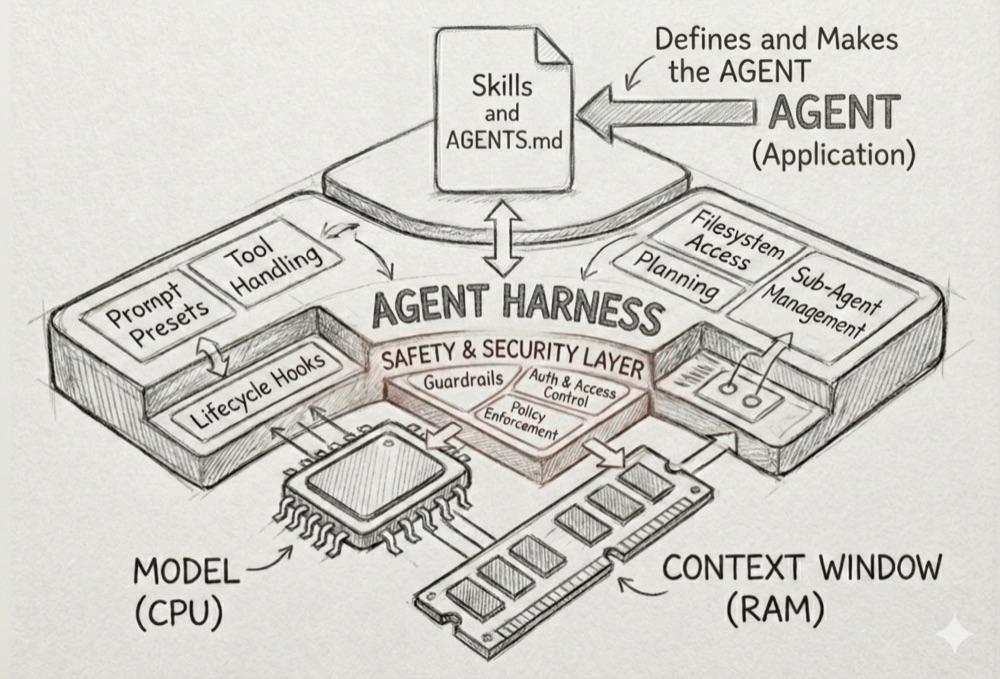

# Agent Harness

**The rig. Not the driver.**

A TypeScript runtime for configuring and running AI agents with any LLM.

[](https://bun.sh/)
[](https://www.typescriptlang.org/)
[](https://opensource.org/licenses/MIT)

---

## What is a Harness?

A harness is infrastructure. It connects an AI model to tools and policies. Not intelligent itself, just reliable plumbing.

| | Harness (this project) | Agent (the LLM) |
|---|------------------------|-----------------|
| Decides actions | No | Yes |
| Enforces safety | Yes | No |
| Has goals | No | Yes (when configured) |
| Ships with behavior | No | Yes (when configured) |

---

## What You Get

**The harness provides:**

- **Model access** — multi-provider, swap between local and cloud at runtime
- **Tool handling** — filesystem, shell, and search tools
- **Safety layer** — workspace constraints and sandbox isolation
- **Session memory** — conversation persistence across interactions
- **Observability** — tracing and logs via OpenTelemetry
- **Extension points** — skills, commands, lifecycle hooks

**The harness does NOT provide:**

- Goals or objectives
- Domain-specific behavior
- Autonomous planning out of the box

Drop in AGENTS.md, commands, and skills. They define the agent.

---

## Demo

```bash
agent

Agent - Conversational Assistant
Version 0.1.0 • OpenAI/gpt-4o
──────────────────────────────────────────────────────────────────────────────
> Say hello to Alice

✓ Complete (2.9s) - msg:1 tool:0

Hello, Alice!

──────────────────────────────────────────────────────────────────────────────
> What was the name I just mentioned?

✓ Complete (1.2s) - msg:1 tool:0

You mentioned "Alice."

──────────────────────────────────────────────────────────────────────────────
> exit
Goodbye!
```

---

## Install

**macOS / Linux / WSL**

```bash
curl -fsSL https://raw.githubusercontent.com/danielscholl/agent-harness/main/install.sh | bash
```

**Windows PowerShell**

```powershell
irm https://raw.githubusercontent.com/danielscholl/agent-harness/main/install.ps1 | iex
```

---

## Quick Start

**1. Initialize configuration**

```bash
agent config init
```

**2. Run interactive chat**

```bash
agent
```

**3. Run a single prompt** (great for scripts)

```bash
agent -p "Say hello to Alice"
```

> **Tip:** `-p` prints clean text by default. Add `--verbose` for traces and execution detail.

---

## Configuration

The harness uses `~/.agent/config.yaml` to manage providers, memory, and observability.

```bash
# View current configuration
agent config show

# Provider setup
agent config provider local       # Docker/Ollama
agent config provider github      # GitHub Models
agent config provider openai      # OpenAI
```

See [docs/architecture/configuration.md](docs/architecture/configuration.md) for complete options.

---

## Usage

```bash
# Interactive chat
agent

# Validate config
agent --check

# Show exposed tools
agent --tools

# Single prompt
agent -p "Analyze this text"

# Switch providers/models on the fly
agent --provider openai -p "Hello"
agent --provider anthropic --model claude-sonnet-4-5-20250929 -p "Hello"
```

---

## Supported LLM Providers

| Provider | Type | Auth Method |
|----------|------|-------------|
| Ollama | Local | None |
| Docker | Local | None |
| Azure AI Foundry | Both | Azure CLI (`az login`) |
| GitHub Models | Cloud | GitHub CLI (`gh auth login`) |
| Azure OpenAI | Cloud | Azure CLI (`az login`) |
| OpenAI | Cloud | API Key |
| Anthropic | Cloud | API Key |
| Google Gemini | Cloud | API Key |

---

## Security Model

| Layer | Mechanism | Protection |
|-------|-----------|------------|
| Application | Workspace root constraints | Tools can't access files outside the workspace |
| OS | `--sandbox` flag | Docker container isolation for process and filesystem |

```bash
# Run with sandbox isolation
agent --sandbox -p "Analyze this codebase"
```

See [docs/guides/sandbox.md](docs/guides/sandbox.md) for details.

---

## Making it Yours

Agent Harness ships neutral. Here's how to configure it:



### AGENTS.md

Create an `AGENTS.md` file in your workspace root to define agent behavior, goals, and constraints. The harness discovers and injects this into the system prompt.

### Custom Commands

Add slash commands in `~/.agent/commands/` to create reusable workflows. Commands are markdown files with YAML frontmatter.

### Skills

Install skills to add capabilities. Skills use progressive disclosure — they inject documentation only when relevant to the user's query.

### Claude Code Compatibility

Agent Harness supports the `.claude/` directory structure for Claude Code compatibility. This allows you to maintain a single set of workspace customizations that work across both tools:

```
<workspace>/.claude/
├── skills/           # Claude Code compatible skills
│   └── my-skill/
│       └── SKILL.md
└── commands/         # Claude Code compatible commands
    └── deploy.md
```

Skills and commands in `.claude/` are automatically discovered. If you have both `.agent/` and `.claude/` directories, `.agent/` takes precedence.

---

## Uninstall

**macOS / Linux / WSL**

```bash
rm -f ~/.local/bin/agent
rm -rf ~/.agent/repo ~/.agent/bin
rm -rf ~/.agent  # optional: remove config
```

**Windows PowerShell**

```powershell
Remove-Item "$env:LOCALAPPDATA\Microsoft\WindowsApps\agent.exe" -Force -ErrorAction SilentlyContinue
Remove-Item "$env:LOCALAPPDATA\Microsoft\WindowsApps\agent.cmd" -Force -ErrorAction SilentlyContinue
Remove-Item "$env:LOCALAPPDATA\Programs\agent-harness" -Recurse -Force -ErrorAction SilentlyContinue
Remove-Item "$env:USERPROFILE\.agent" -Recurse -Force -ErrorAction SilentlyContinue  # removes config, assets, and sessions
```

---

## Architecture

See [Architecture](docs/architecture/README.md).

---

## Contributing

See [CONTRIBUTING.md](CONTRIBUTING.md) for development setup, code quality guidelines, and contribution workflow.

---

## License

MIT — see [LICENSE](LICENSE).
